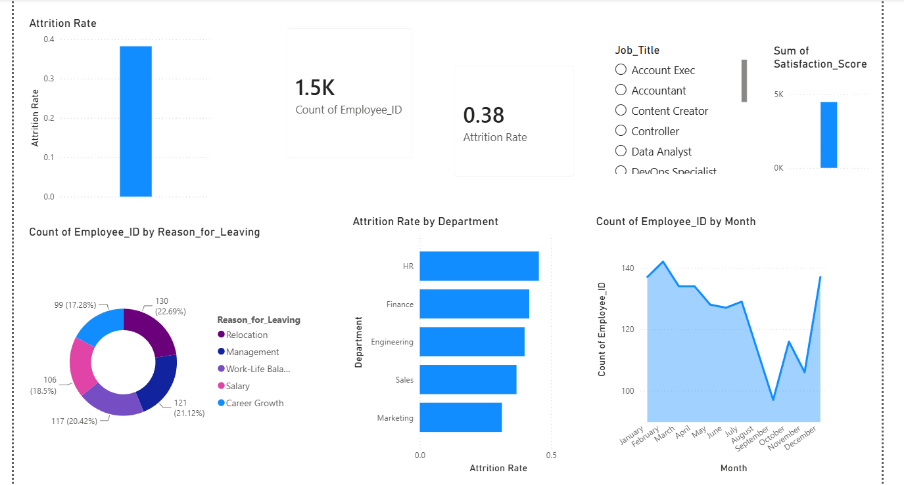
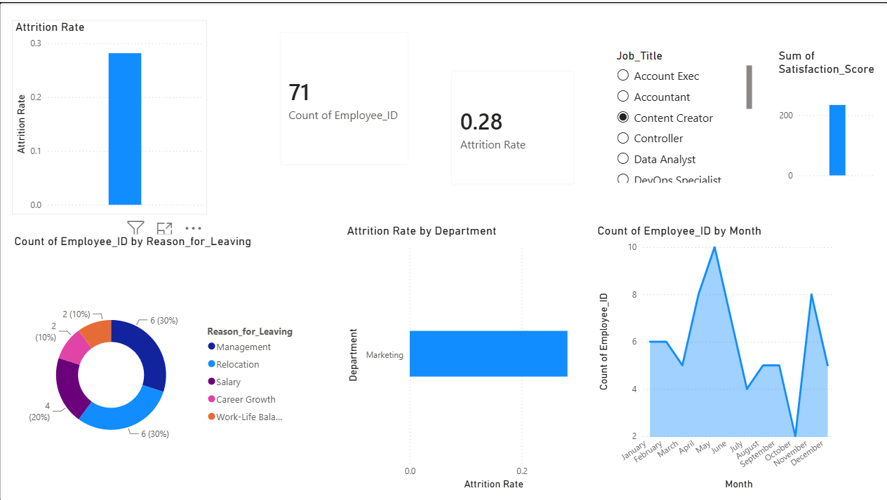

# 👥 HR Workforce Analytics & Retention Dashboard


A complete attrition analysis pipeline — from raw HR data to an interactive Power BI dashboard — built to help leadership understand *why* employees leave and *where* the risk is concentrated.

---

## 📑 Table of Contents

- [Project Overview](#-project-overview)
- [Business Questions Answered](#-business-questions-answered)
- [Data Pipeline & Methodology](#%EF%B8%8F-data-pipeline--methodology)
- [Visual Insights](#-visual-insights)
- [Key Findings](#-key-findings)
- [Project Structure](#-project-structure)
- [Author](#-author)

---

## 🚀 Project Overview

High employee turnover quietly drains a company's productivity and recruitment budget. This project analyzes a human resources dataset of **1,500 employees** to uncover workforce trends, identify which departments carry the highest retention risk, and map hiring momentum over time.

The pipeline — from SQL aggregation to a fully interactive Power BI dashboard — is designed as a diagnostic tool HR teams can actually use to act before dissatisfaction turns into resignations.

---

## 🎯 Business Questions Answered

| # | Question | Why it matters |
|---|---|---|
| 1 | **Retention Drivers** — Why are employees leaving, and what are the leading causes (Salary, Management, Career Growth, etc.)? | Pinpoints where intervention will have the biggest impact |
| 2 | **Risk Centers** — Which departments have the highest attrition rates? | Flags where leadership should focus retention efforts first |
| 3 | **Growth Trajectory** — What do hiring trends look like over the year? | Shows whether the workforce is growing, shrinking, or just churning |

---

## ⚙️ Data Pipeline & Methodology

<details>
<summary><strong>1. Data Engineering & Quality Assurance (Excel)</strong></summary>
<br>

- Standardized inconsistent hiring date formats and resolved null/blank anomalies.
- Applied logical filters so active employees weren't incorrectly linked to exit-interview records.
</details>

<details>
<summary><strong>2. Aggregated Analysis (SQL)</strong></summary>
<br>

- Wrote SQL queries (`hr_analytics_dashboard_queries.sql`) to establish baseline metrics before visualization.
- Calculated departmental turnover rates, aggregated headcount, and structured exit-reason distributions.
</details>

<details>
<summary><strong>3. Metric Creation & Visualization (Power BI)</strong></summary>
<br>

- Built custom DAX measures to create a dynamic, filter-responsive Attrition Rate metric.
- Designed an interactive dashboard letting HR teams slice data by job title, satisfaction score, and department.
</details>

---

## 📊 Visual Insights

**Attrition Overview**
*Headcount, overall attrition rate, and top reasons employees left.*



**Departmental Turnover Analysis**
*Isolating which departments and roles carry the highest flight risk.*



---

## 🔍 Key Findings

- **Overall attrition rate: 38%** across 1,500 employees tracked.
- **Career Growth (22.7%)** and **Management (21.1%)** are the top two reasons employees leave — ahead of Salary (18.5%).
- Attrition is fairly evenly spread across departments (HR, Finance, Engineering, Sales, Marketing), suggesting the issue is **organization-wide**, not isolated to one team.
- Headcount shows a seasonal dip in **September**, recovering by December — worth investigating against hiring/budget cycles.

---

## 📁 Project Structure

```
├── Data/
│   └── hr_analytics_data.csv               # Cleaned dataset
├── SQL_Scripts/
│   └── hr_analytics_dashboard_queries.sql  # Aggregation logic
├── Dashboard/
│   └── hr_analytics_dashboard.pbix         # Power BI project file
├── Media/
│   ├── hr_attrition_overview.png           # Dashboard screenshot
│   └── departmental_turnover.png           # Dashboard screenshot
└── README.md
```

---

## 👨‍💻 Author

**Nizam Ud Din**
B.S. Computer Science — University of Turbat

Data Analyst building hands-on experience with Excel, SQL, and Power BI through real end-to-end projects.

📧 balochnizam410@gmail.com · 🔗 [Portfolio](https://nizam001-ui.github.io/data-analyst-portfolio/)
